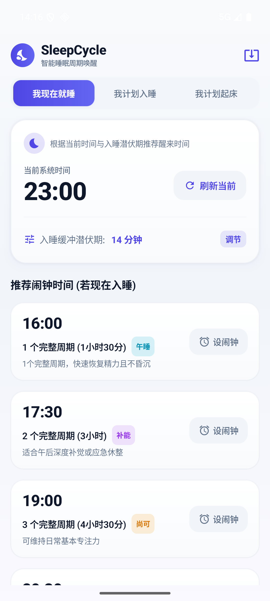
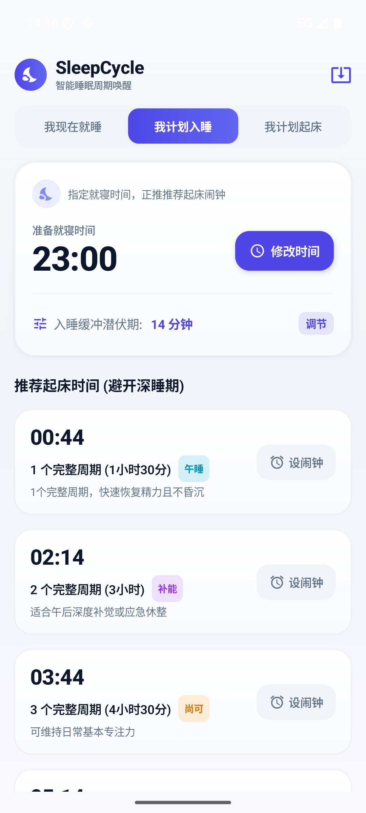
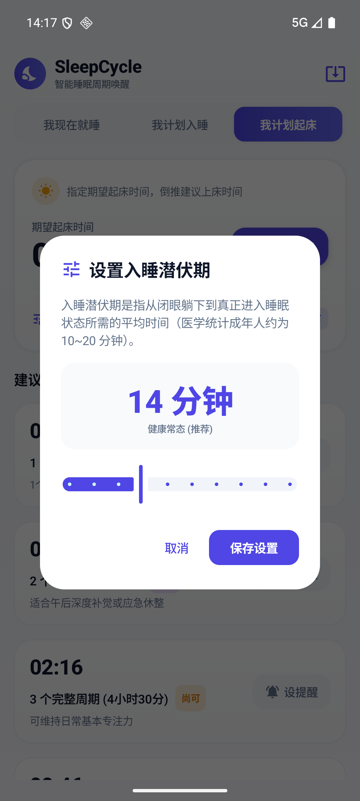

<div align="center">

# 🌙 SleepCycle (睡眠周期计算器 & 智能闹钟)

一款基于科学睡眠周期（90分钟节律 + 入睡潜伏期）构建的现代 Android 应用。帮助你在最合适的时间入睡或醒来，彻底告别起床后的疲惫与睡眠惯性（Sleep Inertia）。

[](https://kotlinlang.org)
[](https://developer.android.com/jetpack/compose)
[](#)
[](LICENSE)

[功能特性](#-功能特性) • [科学原理](#-科学原理) • [界面预览](#-界面预览) • [下载安装](#-下载安装) • [技术架构](#-技术架构) • [本地构建](#-本地构建)

</div>

---

## ✨ 功能特性

- 🛏️ **手动睡眠记录与 14 天分析**：
  - 逐日保存入睡日期、入睡/起床时间、实际主睡眠分钟数和可选午睡分钟数；同一日期再次保存会更新原记录。
  - 默认「睡眠目标」为 480 分钟，可按 15 分钟在 360–600 分钟间调整。跨午夜记录按入睡所在日归档，缺失日期不伪造为已记录睡眠。
  - 「估算睡眠缺口」按最近 14 个完整本地日期计算 `max(0, 睡眠目标 - 主睡眠 - 午睡)` 的总和；它是估算和行为参考，不代表可以精确量化或完全偿还睡眠债务。
  - 「社会时差」分别对工作日与休息日的睡眠中点做跨午夜环形平均；任一组少于 2 条时显示「数据不足」。相关性不等于因果关系。
- 🧮 **Borbély 双过程模型参考**：
  - 使用指数形式的 Process S（清醒累积、睡眠衰减）与 24 小时 Process C 正弦/余弦近似，输出每 30 分钟一个点的 24 小时睡眠压力、昼夜节律警觉信号和综合睡眠倾向。
  - 曲线标注「模型估算」和「模型参考」；时间型睡眠中点优先用于节律相位，没有档案时使用明确的默认相位。模型不测量褪黑素、SCN 或个人生理参数，也不能替代多导睡眠监测。
- 🕒 **三大科学规划模式**：
  - **我现在就睡 (Sleep Now)**：以当前系统时间为基准，自动叠加入睡潜伏期并计算未来 1~6 个周期的最佳起床节点。
  - **规划起床时间 (Wake Up Time)**：输入目标起床时刻，倒推最科学的入睡与上床时间。
  - **规划入睡时间 (Bedtime Plan)**：输入预计上床时刻，正推每一个睡眠周期结束时的苏醒时刻。
- ⚙️ **自定义入睡潜伏期 (Fall-Asleep Latency)**：
  - 默认采用医学统计平均值 14 分钟。
  - 支持 0~60 分钟自定义微调，适配不同人群的入睡速度。
- ⏰ **系统级闹钟一键联动**：
  - 直接调用 Android 原生 `AlarmClock.ACTION_SET_ALARM` Intent。
  - 点击推荐周期卡片即可直接唤起系统原生闹钟并预填标签与时刻，无需后台常驻服务，极度省电且准时。
- ⏱️ **高效小睡模式**：
  - 支持 10 分钟、20 分钟和 90 分钟（1 周期）三档小睡，选择后复用 Android 原生闹钟 Intent。
  - Coffee nap 引导：先提示喝咖啡，再设置 20 分钟小睡，让咖啡因起效时刚好醒来。
  - 10 分钟小睡参考 Brooks & Lack（2006）；NASA 机组研究中的约 26 分钟小睡让警觉度提升约 34%，应用提供 20 分钟短时档作为日常选择。研究结果存在个体差异，仅供参考。
- 🌤️ **醒后缓冲与睡眠惰性提示**：
  - 设定小睡闹钟后提示醒后约 15–60 分钟认知可能未完全恢复，建议接触晨光并做轻度活动。
  - 科普区解释为何睡够 8 小时仍可能昏沉：从深睡阶段被唤醒会产生睡眠惰性。
- 🌅 **起床窗口副标签**：
  - 每张睡眠周期卡片在目标时间下方显示「唤醒窗口 HH:MM–HH:MM」，即 targetTime ± 15 分钟的区间。
  - 弱化单点闹钟的不确定性——睡眠周期在 80~100 分钟间波动、入睡潜伏期因人而异，单个精确钟点并不科学。窗口仅作提示与行为参考，不改闹钟设定与推荐逻辑。
- 🔄 **应用内检查更新**：
  - 顶栏一键连接 GitHub Releases API 检索最新版本并比对语义化版本。
  - 发现新版本时以 Material 3 弹窗展示新版本号、发布时间、更新日志，支持跳转浏览器/直接下载 APK。
- 🧭 **我的时间型（简化 MCTQ/MEQ）**：
  - 分别填写工作日与休息日的入睡、起床时间及是否需要闹钟，计算连续的平均睡眠中点。
  - 结果分为「偏晨型 / 中间型 / 偏夜型」三档；资料不足时显示「待完善」。这只是自我了解工具，不是医学诊断，不能替代完整量表或临床评估。
  - 分类阈值集中在模型常量：睡眠中点早于 05:00 为偏晨型，晚于或等于 07:00 为偏夜型，其余为中间型；跨午夜按实际睡眠时长计算。
- 🌅 **晨间光照与睡前数字日落**：
  - 根据起床/入睡时间生成起床后尽快接触户外光 10–30 分钟，以及目标入睡前 60–120 分钟开始数字日落的建议。
  - 可通过现有系统闹钟 Intent 设置提醒；App 不测量 lux、不检测褪黑素，也不申请通知、定位或健康传感器权限。蓝光过滤器不被描述为确定有效的治疗，建议仅供参考并考虑个体差异。
- 🎨 **Material 3 现代美学**：
  - 沉浸式暗色调夜间主题与精致的卡片化排版。
  - 针对 5 周期黄金睡眠（7.5小时 + 潜伏期）智能高亮与推荐。
  - 严谨的跨天时间计算与边界防护（如 `23:30 -> 次日` 或 `00:30 -> 前日`）。

---

## 🔬 科学原理

人体的夜间睡眠由多个连续的 **睡眠周期 (Sleep Cycles)** 组成，每个周期平均约为 **90 分钟**。在一个周期内，大脑会经历浅睡眠（N1/N2）、深睡眠（N3）以及快速眼动睡眠（REM）。

如果在**深睡眠阶段**被闹钟惊醒，人会感到异常疲惫、头晕并产生严重的睡眠惯性；而如果在**周期结束时的浅睡眠或 REM 阶段末期**醒来，身体会感到神清气爽、精力充沛。

时间型与光照建议的依据包括：Borbély（1982）双过程睡眠调节综述与昼夜节律研究；Horne & Östberg（1976）《A self-assessment questionnaire to determine morningness-eveningness》；Roenneberg 等（2003）基于 MCTQ 的社会时差研究。睡眠缺口定义参考 Van Dongen 等（2003）关于睡眠限制与累积缺口/警觉表现的研究；社会时差概念参考 Roenneberg 等（2003）及 MCTQ 研究。双过程曲线是启发式近似，不是个人生理实测，不能替代多导睡眠监测；统计相关性不等于因果关系。以上资料访问日期：2026-08-26。

$$睡眠总时长 = 周期数 \times 90分钟 + 入睡潜伏期（默认14分钟）$$

| 周期数 | 纯睡眠时间 | 综合评级 | 适用场景 |
| :---: | :---: | :---: | :--- |
| **6 周期** | 9 小时 | 极佳 (Excellent) | 充分休息 / 补觉恢复 |
| **5 周期** ⭐ | 7.5 小时 | 黄金推荐 (Recommended) | 成年人最佳健康作息 |
| **4 周期** | 6 小时 | 尚可 (Moderate) | 工作日紧凑作息 |
| **3 周期** | 4.5 小时 | 偏短 (Short) | 临时熬夜 / 应急短睡眠 |
| **1-2 周期** | 1.5 - 3 小时 | 极短 (Very Short) | 高效午休 / 强力小憩 (Power Nap) |

---

## 📱 界面预览

<div align="center">
  
  
  
</div>

---

## 📥 下载安装

前往 [Releases 页面](../../releases/latest) 下载最新的 APK 安装包：
- **[SleepCycle-v1.7.0.apk](../../releases/latest)**

> 适配 Android 8.0 (API Level 26) 及以上版本系统。

---

## 🛠 技术架构

- **语言 & 工具链**：Kotlin 2.0+, Gradle 8.9+, JDK 17
- **UI 框架**：Jetpack Compose (Material Design 3)
- **架构模式**：MVVM (Model-View-ViewModel) + 单向数据流 (UDF)
- **核心组件**：
  - `SleepCalculator`: 纯 Kotlin 周期算力引擎（100% 单元测试覆盖）
  - `AlarmIntentManager`: 系统原生闹钟协议封装与容错处理
  - `ChronotypeCalculator` + `LightGuidanceCalculator`: 时间型中点分类、晨光与数字日落建议
  - `SleepRecordEntity` + `SleepSettingsEntity` + Room version 2：手动睡眠记录与睡眠目标，显式保留 version 1 时间型档案
  - `SleepStatsCalculator` + `SocialJetLagCalculator` + `TwoProcessModel`：14 天估算统计和 24 小时模型曲线
  - `SleepViewModel` & `StateFlow`: 响应式状态管理

---

## 💻 本地构建与开发

### 环境要求
- Android Studio Ladybug / Koala 或更高版本
- JDK 17
- Android SDK 35 (minSdk 26)

### 编译与测试指令
```bash
# 克隆仓库
git clone https://github.com/michiru233/SleepCycle.git
cd SleepCycle

# 运行单元测试
./gradlew testDebugUnitTest

# 构建 Debug APK
./gradlew assembleDebug

# 构建 Release APK
./gradlew assembleRelease
```

---

## 📄 开源许可证

本项目基于 [MIT License](LICENSE) 协议开源。
