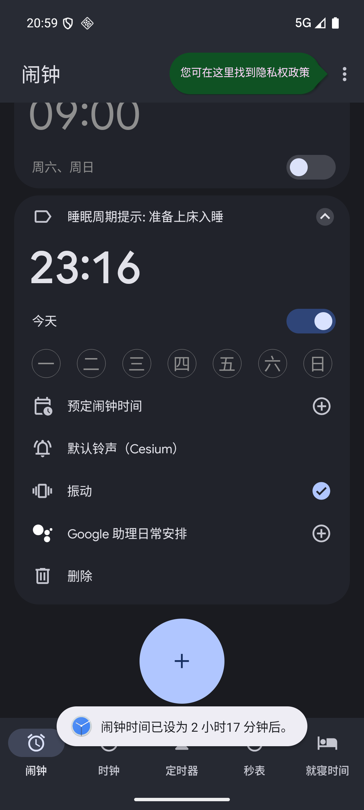

<div align="center">

# 🌙 SleepCycle (睡眠周期计算器 & 智能闹钟)

一款基于科学睡眠周期（90分钟节律 + 入睡潜伏期）构建的现代 Android 应用。帮助你在最合适的时间入睡或醒来，彻底告别起床后的疲惫与睡眠惯性（Sleep Inertia）。

[](https://kotlinlang.org)
[](https://developer.android.com/jetpack/compose)
[](#)
[](LICENSE)

[功能特性](#-功能特性) • [科学原理](#-科学原理) • [界面预览](#-界面预览) • [下载安装](#-下载安装) • [技术架构](#-技术架构) • [本地构建](#-本地构建)

</div>

---

## ✨ 功能特性

- 🕒 **三大科学规划模式**：
  - **我现在就睡 (Sleep Now)**：以当前系统时间为基准，自动叠加入睡潜伏期并计算未来 1~6 个周期的最佳起床节点。
  - **规划起床时间 (Wake Up Time)**：输入目标起床时刻，倒推最科学的入睡与上床时间。
  - **规划入睡时间 (Bedtime Plan)**：输入预计上床时刻，正推每一个睡眠周期结束时的苏醒时刻。
- ⚙️ **自定义入睡潜伏期 (Fall-Asleep Latency)**：
  - 默认采用医学统计平均值 14 分钟。
  - 支持 0~60 分钟自定义微调，适配不同人群的入睡速度。
- ⏰ **系统级闹钟一键联动**：
  - 直接调用 Android 原生 `AlarmClock.ACTION_SET_ALARM` Intent。
  - 点击推荐周期卡片即可直接唤起系统原生闹钟并预填标签与时刻，无需后台常驻服务，极度省电且准时。
- 🎨 **Material 3 现代美学**：
  - 沉浸式暗色调夜间主题与精致的卡片化排版。
  - 针对 5 周期黄金睡眠（7.5小时 + 潜伏期）智能高亮与推荐。
  - 严谨的跨天时间计算与边界防护（如 `23:30 -> 次日` 或 `00:30 -> 前日`）。

---

## 🔬 科学原理

人体的夜间睡眠由多个连续的 **睡眠周期 (Sleep Cycles)** 组成，每个周期平均约为 **90 分钟**。在一个周期内，大脑会经历浅睡眠（N1/N2）、深睡眠（N3）以及快速眼动睡眠（REM）。

如果在**深睡眠阶段**被闹钟惊醒，人会感到异常疲惫、头晕并产生严重的睡眠惯性；而如果在**周期结束时的浅睡眠或 REM 阶段末期**醒来，身体会感到神清气爽、精力充沛。

$$睡眠总时长 = 周期数 \times 90分钟 + 入睡潜伏期（默认14分钟）$$

| 周期数 | 纯睡眠时间 | 综合评级 | 适用场景 |
| :---: | :---: | :---: | :--- |
| **6 周期** | 9 小时 | 极佳 (Excellent) | 充分休息 / 补觉恢复 |
| **5 周期** ⭐ | 7.5 小时 | 黄金推荐 (Recommended) | 成年人最佳健康作息 |
| **4 周期** | 6 小时 | 尚可 (Moderate) | 工作日紧凑作息 |
| **3 周期** | 4.5 小时 | 偏短 (Short) | 临时熬夜 / 应急短睡眠 |
| **1-2 周期** | 1.5 - 3 小时 | 极短 (Very Short) | 高效午休 / 强力小憩 (Power Nap) |

---

## 📱 界面预览

<div align="center">
  
  
  
</div>

---

## 📥 下载安装

前往 [Releases 页面](../../releases/latest) 下载最新的 APK 安装包：
- **[SleepCycle-v1.0.apk](../../releases/latest)**

> 适配 Android 8.0 (API Level 26) 及以上版本系统。

---

## 🛠 技术架构

- **语言 & 工具链**：Kotlin 2.0+, Gradle 8.9+, JDK 17
- **UI 框架**：Jetpack Compose (Material Design 3)
- **架构模式**：MVVM (Model-View-ViewModel) + 单向数据流 (UDF)
- **核心组件**：
  - `SleepCalculator`: 纯 Kotlin 周期算力引擎（100% 单元测试覆盖）
  - `AlarmIntentManager`: 系统原生闹钟协议封装与容错处理
  - `SleepViewModel` & `StateFlow`: 响应式状态管理

---

## 💻 本地构建与开发

### 环境要求
- Android Studio Ladybug / Koala 或更高版本
- JDK 17
- Android SDK 35 (minSdk 26)

### 编译与测试指令
```bash
# 克隆仓库
git clone https://github.com/michiru233/SleepCycle.git
cd SleepCycle

# 运行单元测试
./gradlew testDebugUnitTest

# 构建 Debug APK
./gradlew assembleDebug

# 构建 Release APK
./gradlew assembleRelease
```

---

## 📄 开源许可证

本项目基于 [MIT License](LICENSE) 协议开源。
